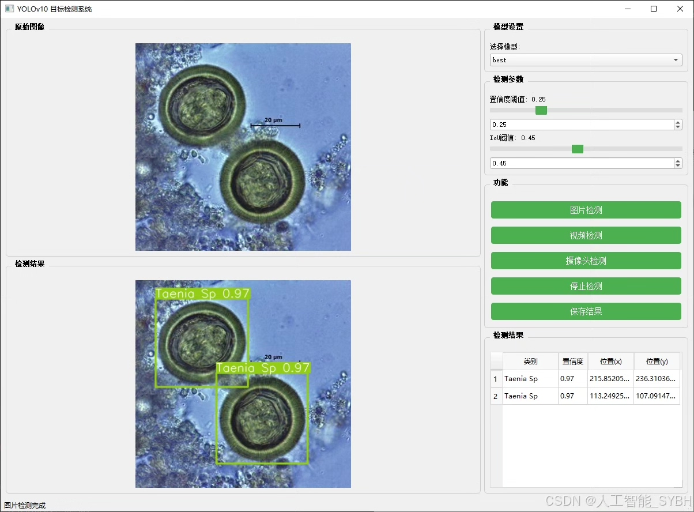
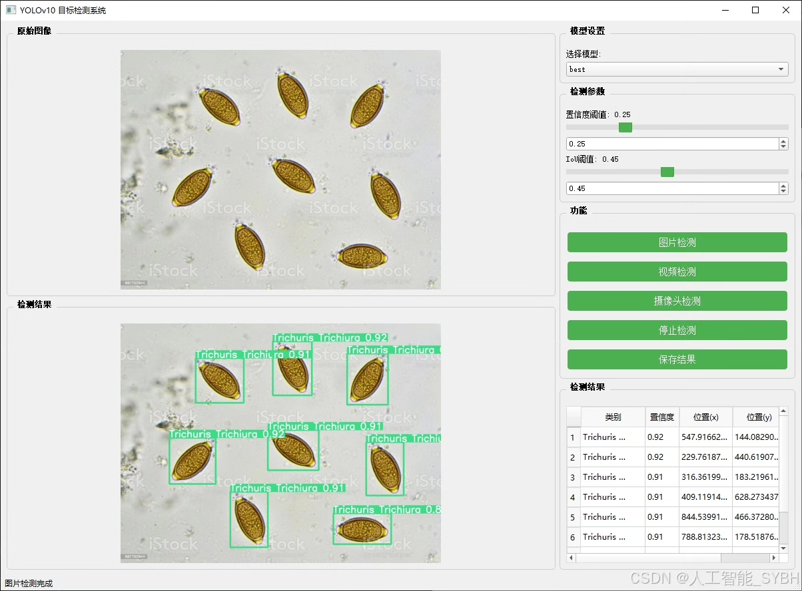
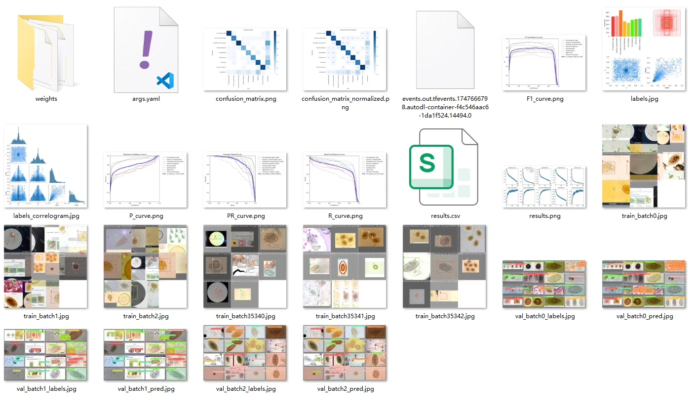
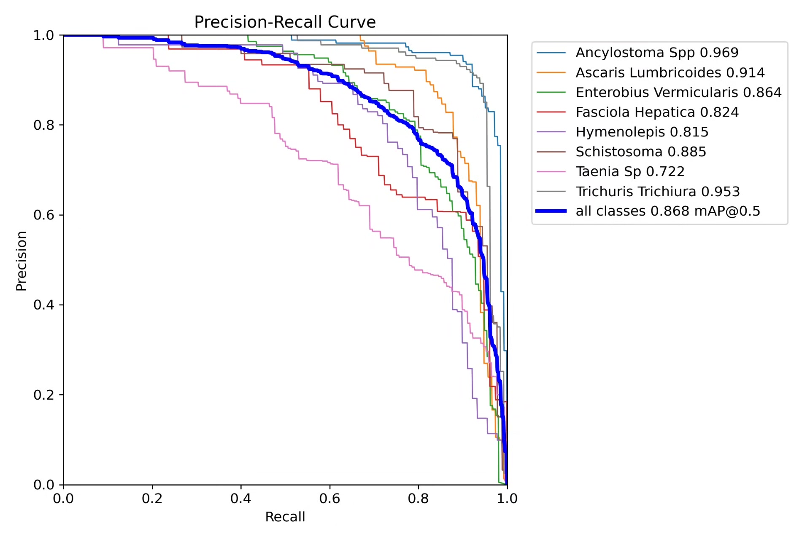
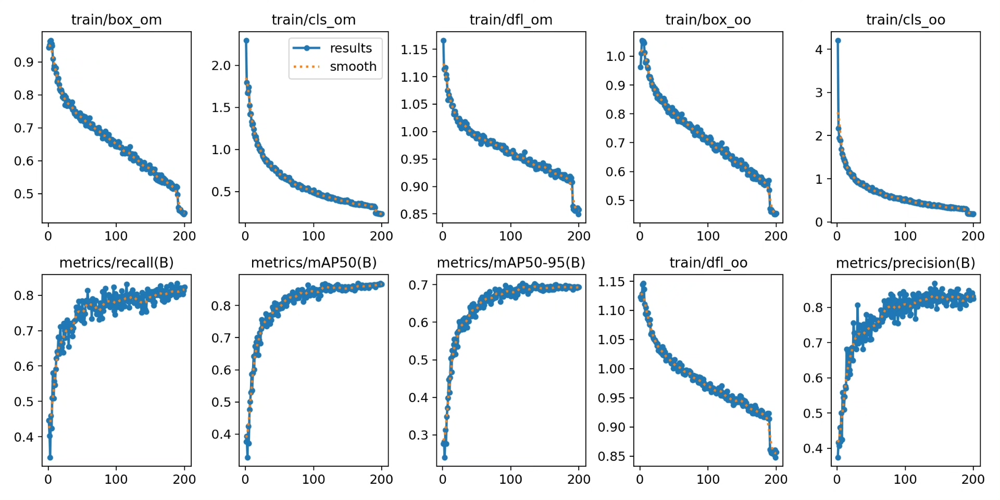
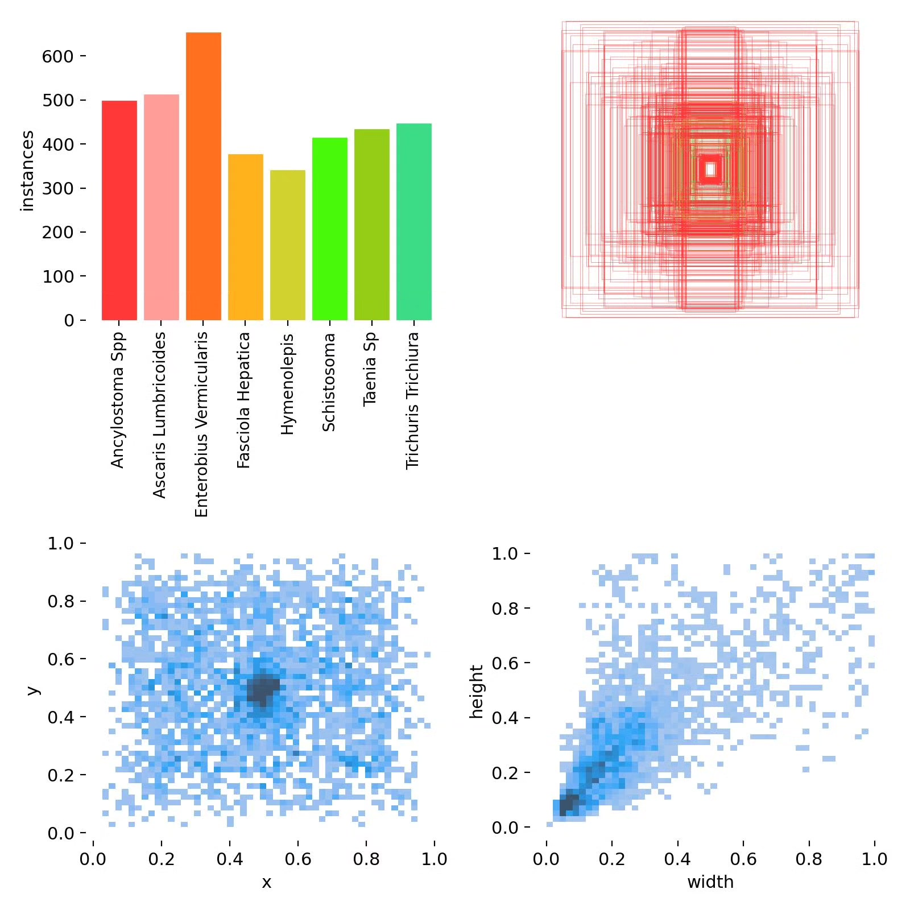
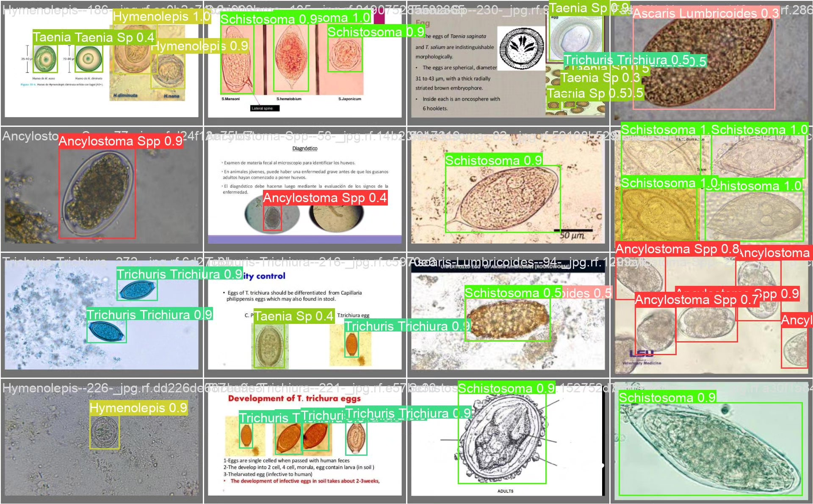
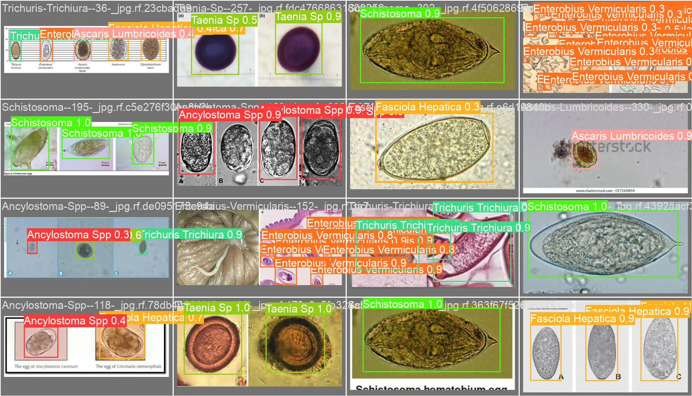

# Parasitic worm classification and detection system based on deep learning YOLOv10

## Body

Based on the advanced YOLOv10 object detection framework, this project has developed a high-precision parasitic worm identification and recognition system. It is specifically designed for detecting and classifying eight common human parasitic worms: Ancylostoma spp., Ascaris lumbricoides, Enterobius vermicularis, Fasciola hepatica, Hymenolepis, Schistosoma, Taenia sp., and Trichuris trichiura. The system has built a professional dataset containing 2110 high-quality labeled images (1484 training set, 411 validation set, 215 test set). Through the improved YOLOv10 network structure, breakthroughs have been achieved in key technologies such as small target detection in microscopic images and distinguishing similar morphological worm species. Test results show that the system significantly outperforms traditional microscope inspection efficiency in the task of identifying 8 types of parasites. This system provides an intelligent solution for rapid diagnosis and epidemiological research of parasitic diseases.

The company's products have obtained the official commercial license certification from YOLO.

We provide after-sales service.

After payment, we will provide WeChat ID for any questions.

Environmental configuration: We will provide a tutorial on environmental configuration, and WeChat will provide答疑.

Remote installation service: If you need remote configuration, an additional fee of 69 is required, with all fees refunded if the configuration fails (only refund installation fees for special old computers).

Retraining dataset: After setting up the environment, you can train on your own computer. If you need us to retrain, just pay 69 plus computing power fees (2.5 yuan/hour).

Full after-sales service

## Images

## Payment

Here is a pay link on Stripe ( https://buy.stripe.com/3cs8yP7sY87d0vu9AB ). Please contact me lonlonago@foxmail.com after funding $89, and I will send you a complete data files , thank you!

